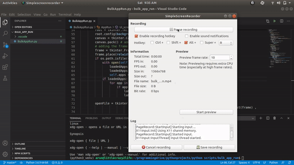

# Bulk Run

- Click the "open File" to choose file or application,for adding to the list.
- Create a list of application/files u want.
- Click the "let Start" to start all the application/files to open by default programmes.

# usage case:

- To open set of application or files everyday.

# coming updates:

- Add different set profiles to the list,to create set of application to open for work,game...

